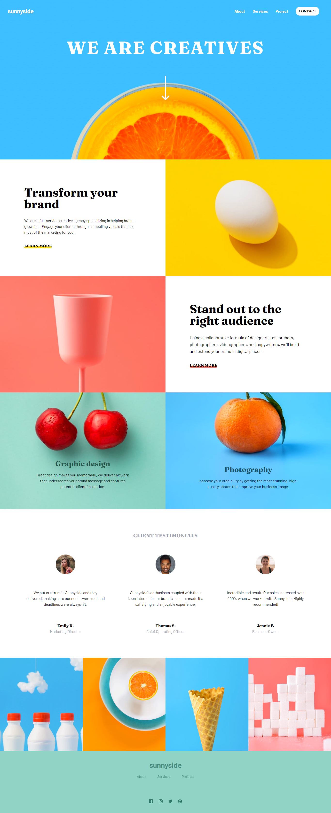
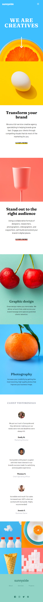

# Sunnyside Agency Landing Page

Project ini berdasarkan pada challenge di Frontend Mentor [Sunnyside agency landing page challenge on Frontend Mentor](https://www.frontendmentor.io/challenges/sunnyside-agency-landing-page-7yVs3B6ef).

## Daftar Isi

- [Overview](#overview)
  - [Penjelasan Project](#the-challenge)
  - [Screenshot](#screenshot)
  - [Links](#links)
- [Proses](#proses)
  - [Stack yang digunakan](#stack-yang-digunakan)
  - [Hal yang dipelajari](#hal-yang-dipelajari)
  - [Resources](#resources)
- [Author](#author)

## Overview

### Penjelasan Project

Pada project ini saya membangun sebuah landing page yang semirip mungkin dengan desain yang diberikan oleh Frontend Mentor.
Fokus utama pada project ini adalah HTML dan CSS, dengan tambahan javascript.
Objektif pada project ini:

- Menampilkan layout yang sesuai dengan ukuran layar(responsive)
- Memberikan interaksi pada web(_hover_, _scrollIntoView_)

### Screenshot

**Tampilan Desktop**


**Tampilan Mobile**


### Links

- Solution URL: [Add solution URL here](https://your-solution-url.com)
- Live Site URL: [Add live site URL here](https://your-live-site-url.com)

## Proses

### Stack yang digunakan

- Semantic HTML5 markup
- [Tailwind CSS](https://tailwindcss.com/) - CSS Framework
- Flexbox
- CSS Grid
- Mobile-first workflow
- Vanilla JavaScript

### Hal yang dipelajari

Banyak hal yang dipelajari dari project ini terutama adalah framework Tailwind CSS. Membuat responsive web menjadi sangat mudah dengan menggunakan Tailwind CSS. Selain itu saya juga belajar _scrollIntoView method_ pada javascript. Penggunaan _scrollIntoView method_ pada project saya:

```JavaScript
const arrow = document.querySelector(".arrow");

arrow.addEventListener("click", () => {
  main.scrollIntoView({ behavior: "smooth" });
});
```

### Resources

- [Tailwind CSS Documentation](https://tailwindcss.com/docs/installation)
- [Mozilla MDN JavaScript Documentation](https://developer.mozilla.org/en-US/docs/Web/JavaScript)

## Author

- Website - [abiproject.com](https://www.abiproject.com)
- Frontend Mentor - [@abimh66](https://www.frontendmentor.io/profile/abimh66)
- Codewars - [@abimh66](https://www.codewars.com/users/abimh66)
- Twitter - [@abimhrdnt](https://www.twitter.com/abimhrdnt)
